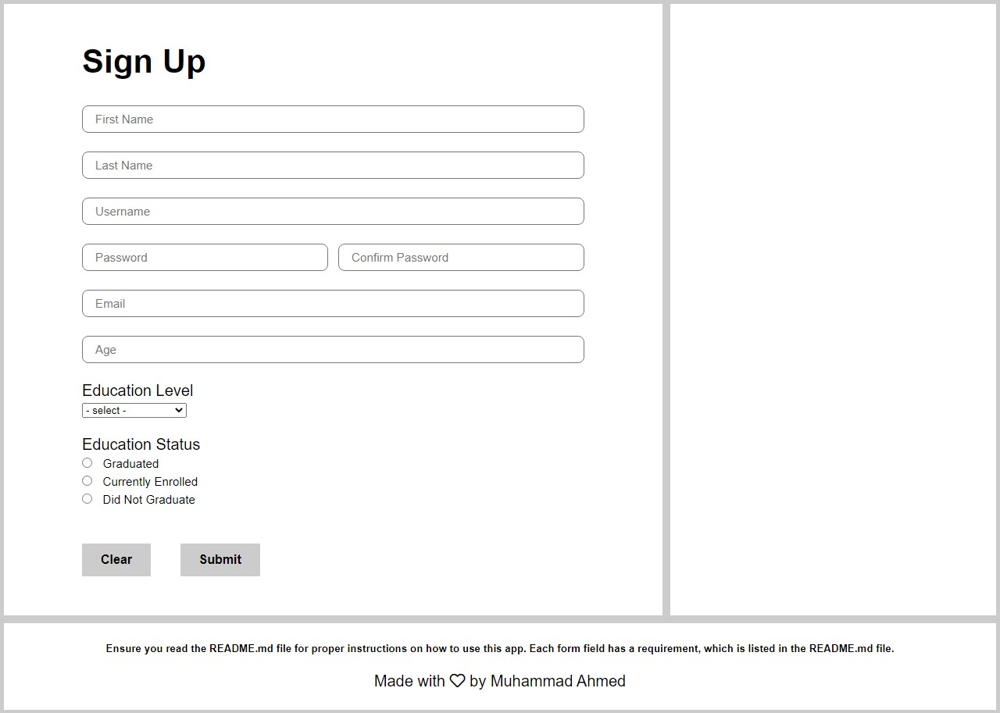
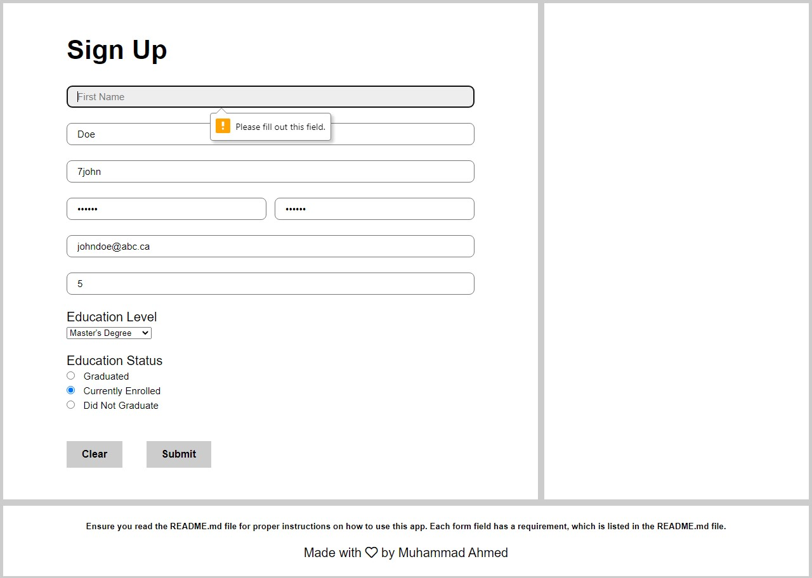
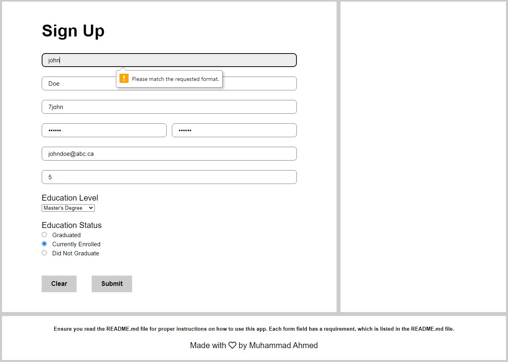
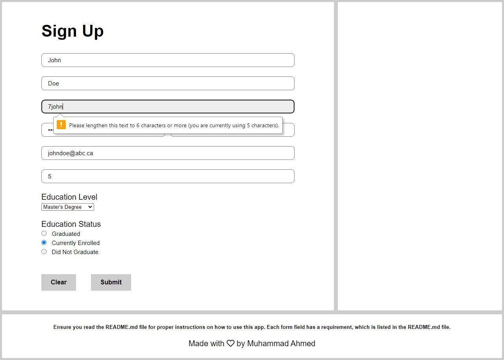
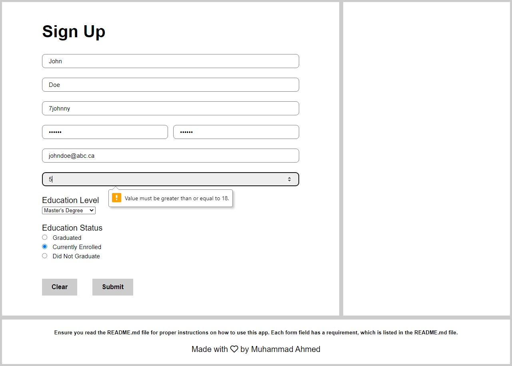
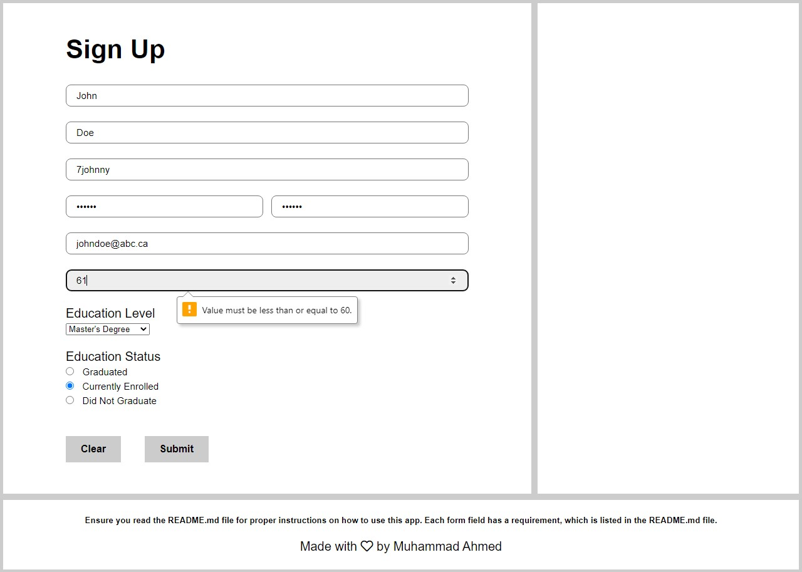
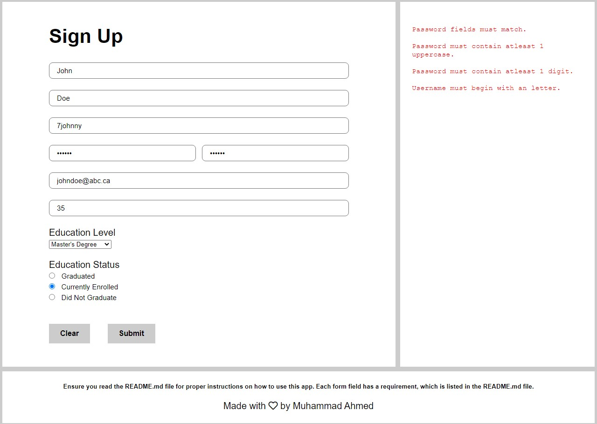
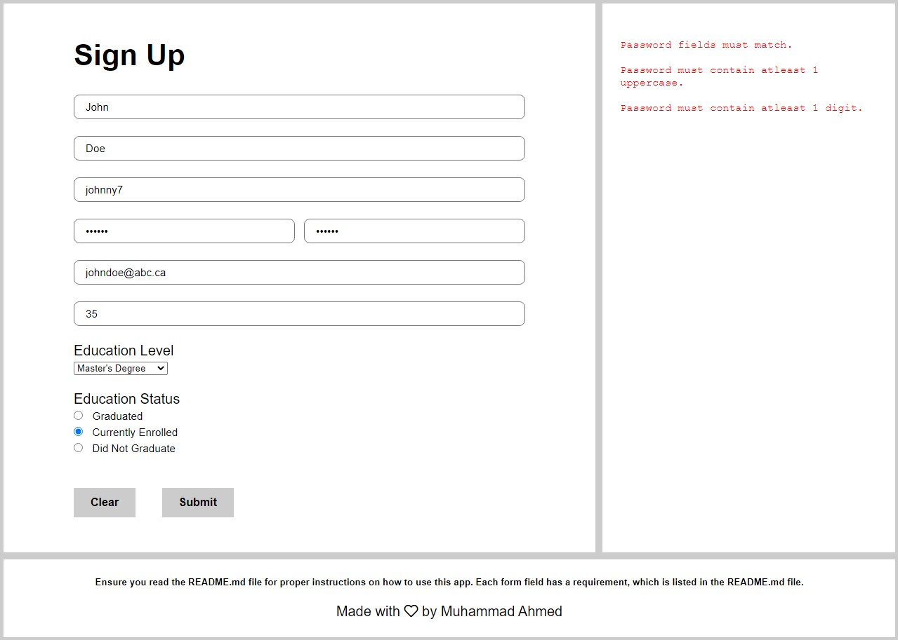
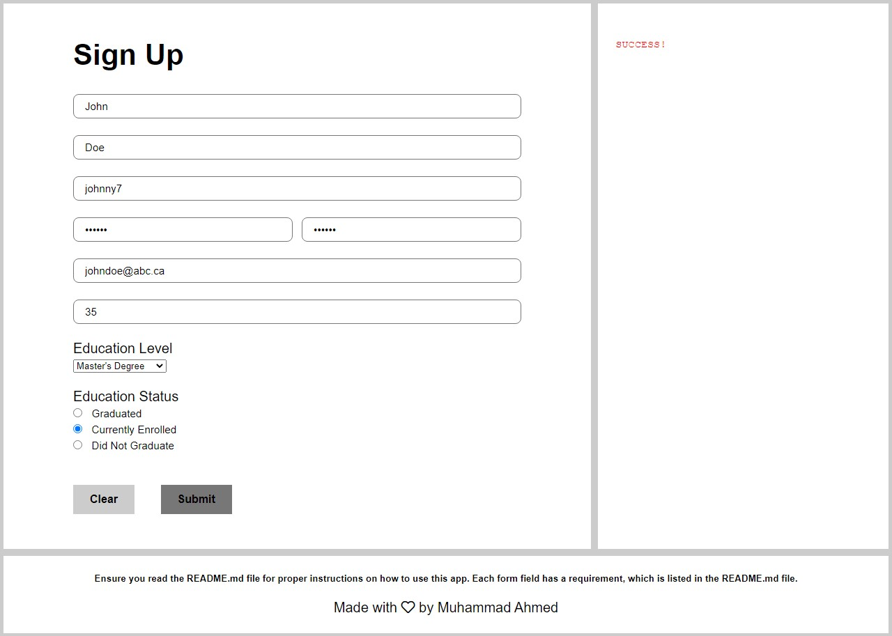
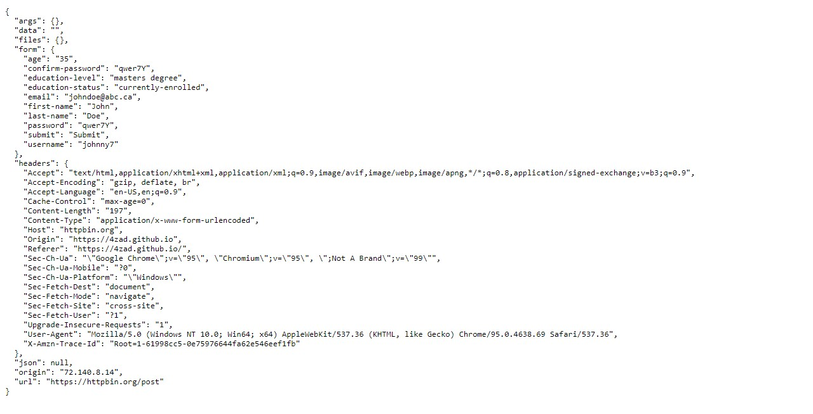

# Form Validation Project

**Version 1.0.0**

## Table of Contents
[Description](#Description)\
[Instructions](#Instructions)\
[Technologies](#Technologies)\
[Workflow](#Workflow)\
[Author](#Author)\
[License & Copyright](#License%20&%20Copyright)

---
## Description

A responsive, form validation web application created through the use of vanilla HTML, CSS, JavaScript, and Document Object Model (DOM) fundamentals. The form is set to validate a set of requirements, that I have created myself, for each form field to simulate registration forms and survey forms that are abundantly found on a multitude of websites on the web. The validation is done through the use of HTML attributes and checking for regular expression patterns through JavaScript. The JavaScript code utilizes concise, reusable, and well structured code, which adheres to object oriented programming principles, such as abstraction and modular programming.

#### Inspiration

With the internet being so massive now, it is no surprise that it is filled with various different types of forms; whether that be for registration, login, data entry, or even surveys. All of these forms require a variety of different types of information, with each piece of information following a variety of different criteria. This means that the ability to create forms that require the user to input information in the format that is appropriate for a form field is an essential skill for any web developer. This is where I got the idea to create a form that has a variety of different criteria/requirements for each of its form fields. 

#### Idea

I decided to create web application in the form of a form (no pun intended). This application would have a basic set of criteria that would be coded into the HTML directly using the attributes of form elements and there would also be a more sophisticated set of criteria for the username and password that would show up in an error panel once the user attempts to submit the form (which would be done using JavaScript, the Document Object Model, and regular espressions). Furthermore, the form would not submit unless all the criteria required by the form is met. 

There were 2 major reasons why I decide to split the form requirement handling between the HTML and JavaScript. One was that if each and every error message was to be displayed in the error panel, it would become very crowded; from a user experience perspective this would be horrid. The other was that using the pattern attribute with regular expressions in HTML alone simply gives the user the message, "Please match the requested format," without any detail as to what the actual format taht should be followed is; again, from a user experience perspective this would be horrid. By using JavaScript and the Document Object Model with regular espressions, I could insert the exact required format/criteria to the error panel. 

Overall, this project would help me develop the necessary skills that enable me to create a whole array of different types of forms that exist on the web.

#### Demo

---
## Instructions

The use of this web application requires you to fill out a form and input values into each field that match each field's respective requirements. 

**The requirements are listed below:**

- *All fields* are mandatory and must be completed before the form can be submitted; leaving any field incomplete will result in not being able to submit the form
- The *first name* must begin with an uppercase and must only contain letters (that are part of the english alphabet)
- The *last name* must begin with an uppercase and must only contain letters (that are part of the english alphabet)
- The *username* must be a minimum of 6 characters in length and must begin with a letter (that is part of the english alphabet)
- The *password* and *confirm password* fields must match
- The *password* must be exactly 6 characters in length, must begin with a letter (that is part of the english alphabet), must contain atleast 1 uppercase, and must contain atleast 1 digit
- The *email* must follow the format of a valid email address
- The *age* must be between 18 and 60 inclusive [17 < age < 61]

Now that you have read the instructions, feel free to try out the form validation app for yourself [here](https://4zad.github.io/form-validation/).

---
## Technologies

The creation of the form validation app involved the use of various technologies, including:

- HTML5 (HyperText Markup Language)
- CSS (Cascading Style Sheets)
- JS (JavaScript)
- Bootstrap v5.0 

It involved the use of the plugins below, as well:

- Google Fonts
- Font Awesome 6

The project also required knowledge of:

- Document Object Model (DOM)
- Regular Expressions

---
## Workflow

I began this project by deciding on a set of form fields that I would utilize and then defining what the requirements for each field would be. Once that was decided, I moved on to designing the actual UX/UI of the form validation app. By defining the requirements of each field and a design to follow before-hand, I attempted to mimic what development looks like on the job. Where UX/UI designers will typically create the design and supposed functionality and the developers, would translate that into an actual website/application. 

Once it was time to actually begin coding, I researched and wrote out the HTML for the actual form, which included small requirements, sucha as the length, for each field. After this I tested my form to make sure everything was functioning properly, before I coded the rest of the form validation app (footer, error panel). Once that was complete, I began styling the app. I had decided on a simple, clear, legible, and functional design for the app before-hand, which I followed through with. For this project, my styling abilities were not the showcase and thus, I decided to keep the design simple and functional.

Once the app was styled, it was time to add functionality to the error panel. I began by first creating a function in the 'app.js' file, which would mimic a 'main' function and would be called whenever a form is submitted. This function would return 'true', and let the form submission go through, if the password and username fields matched the required format/criteria and 'false' otherwise. I then went on to create other functions that utilized the Document Object Model (DOM) and regular expressions to check the username and password and ensure that they matched the required format/criteria. Finally, I created another set of functions that utilized the Document Object Model (DOM) to clear the error panel of previous error messages and display any new ones. Since this part of the project is what turned this project from a webpage to a web application, the completion of this script involved a lot of testing. Eventually, the form validation app passed the thorough testing and I was done!

---
## Author

- Muhammad Ahmed (4zad) <mahmed.4zad@gmail.com>

---
## License & Copyright

Copyright © 2021 Muhammad Ahmed (4zad).
All rights reserved.

---
*THIS PROJECT IS NOW FINISHED AND ARCHIVED*
